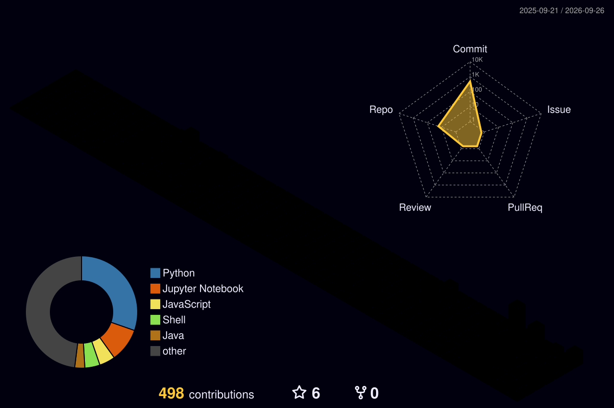

<div align="center">


</div>

<h1 align="center">Maralbyek Tilyek</h1>
<h3 align="center">Cybersecurity ~ Machine Learning student & practitioner &amp; Web Security</h3>

<p align="center">
Computer Science / Cybersecurity student focused on practical, hands-on security work over certificate collecting.<br>
I build detection tools, investigate logs in Splunk, and break (then explain) web applications in controlled labs and train ML models for prediction.
</p>

<p align="center">
  <a href="https://www.linkedin.com/in/maralbyek-tilyek-6b2963359/"></a>
  <a href="https://tryhackme.com/p/maralbektilek"></a>
  <a href="mailto:maralbektilek@gmail.com"></a>
</p>

<br>

## `~$` Currently Working On

```bash
[+] Expanding the Python port scanner with a full CVE-lookup module
[+] Writing up SOC investigation reports from Splunk log analysis
[+] Working through additional PortSwigger Web Security Academy labs
[+] Sharpening blue-team detection skills through TryHackMe rooms
```

<br>

## `~$` Cybersecurity Focus

<table>
<tr>
<td width="50%" valign="top">

**Blue Team / SOC**
- Log analysis & investigation (Splunk)
- Failed logon / account lockout triage
- PowerShell & process-creation event analysis
- Detection engineering fundamentals

</td>
<td width="50%" valign="top">

**Offensive & Applied Security**
- Network reconnaissance & port scanning
- Web application security (SQLi, XSS)
- File/data cryptography (AES)
- ML-assisted phishing detection

</td>
</tr>
</table>

<br>

## `~$` Security Arsenal

<div align="center">

**Languages**
<br>


**Security Tools**
<br>


**Operating Systems & Platforms**
<br>


**Databases**
<br>


</div>

<br>

## `~$` Featured Projects

<table>
<tr>
<td width="50%">

### 🛡️ [SOC / Splunk Security Investigation](https://github.com/YOUR_GITHUB_USERNAME/soc-splunk-investigation)
Investigated failed logons, account lockouts, PowerShell activity, and process creation events in Splunk Enterprise using Windows security log datasets. Produced visual findings and a written investigation report.
<br>`Splunk` `Windows Event Logs` `SOC`

</td>
<td width="50%">

### 🐟 [Phishing Email Detection (ML)](https://github.com/YOUR_GITHUB_USERNAME/phishing-email-detection-ml)
Machine learning model that analyzes email content and predicts whether a message is phishing.
<br>`Python` `Machine Learning`

</td>
</tr>
<tr>
<td width="50%">

### 🔎 [Python Network Port Scanner](https://github.com/YOUR_GITHUB_USERNAME/python-network-port-scanner)
Custom port scanner built from scratch in Python (not a wrapper around Nmap) — scans ports, detects services/versions, and performs CVE-related lookups.
<br>`Python` `Networking` `CVE Lookup`

</td>
<td width="50%">

### 🔐 [AES File Encryption Tool](https://github.com/YOUR_GITHUB_USERNAME/aes-file-encryption-tool)
File encryption/decryption tool built around AES cryptography.
<br>`Python` `Cryptography`

</td>
</tr>
<tr>
<td width="50%">

### 🕸️ [Web Security / PortSwigger Labs](https://github.com/YOUR_GITHUB_USERNAME/web-security-portswigger-labs)
Practical web application security labs covering SQL injection and XSS, solved using Burp Suite.
<br>`Burp Suite` `SQLi` `XSS`

</td>
<td width="50%">

### 🍜 [Malaysian Food Allergen Checker](https://github.com/YOUR_GITHUB_USERNAME/malaysian-food-allergen-checker)
Full-stack application to check Malaysian food items for allergens — React/TypeScript frontend with a Python backend and database.
<br>`React` `TypeScript` `Python`

</td>
</tr>
</table>

<br>

## `~$` GitHub Statistics

<div align="center">


<br>


<br>


</div>

<br>

## `~$` 3D Contribution Graph

<div align="center">

<!-- These images are generated automatically by the GitHub Action in .github/workflows/profile-3d-contrib.yml -->


</div>

<br>

## `~$` Learning Roadmap

```text
[x] Networking & Linux fundamentals (TryHackMe)
[x] Web security fundamentals — SQLi, XSS (PortSwigger Labs)
[x] Applied cryptography — AES file encryption
[x] SOC log investigation — Splunk, Windows Event Logs
[x] Security certifications                 []
[ ] Deeper detection engineering / SIEM rule authoring
[ ] Cloud security fundamentals
[ ] CTF participation
```

<br>

## `~$` Contact

<div align="center">

<a href="YOUR_LINKEDIN_URL"></a>
<a href="YOUR_TRYHACKME_URL"></a>
<a href="mailto:YOUR_EMAIL"></a>

<br><br>


<sub>Built with focus on practical security work — not badge collecting.</sub>

</div>
